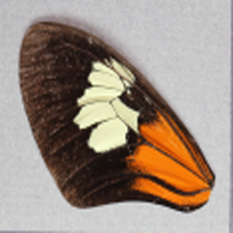
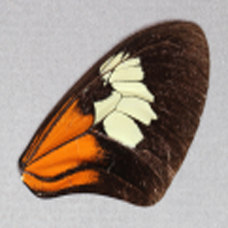
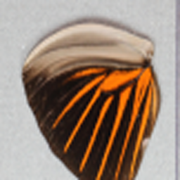
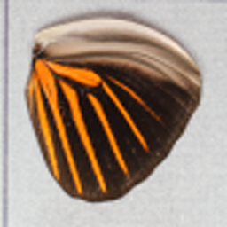
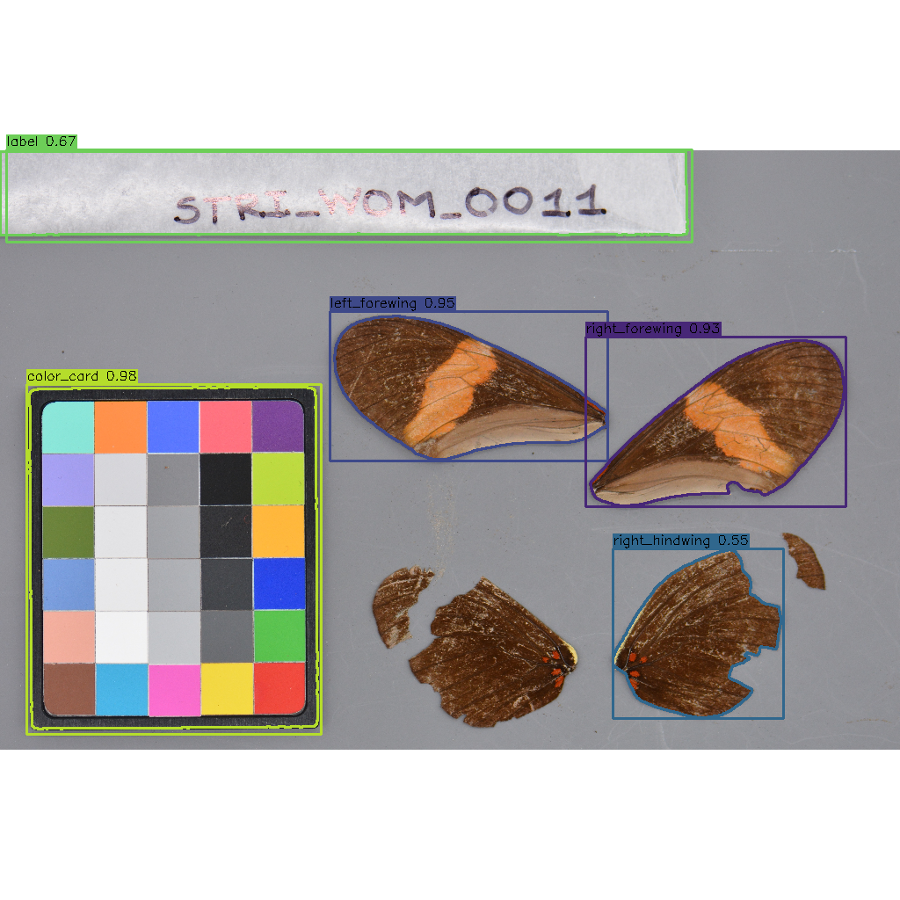
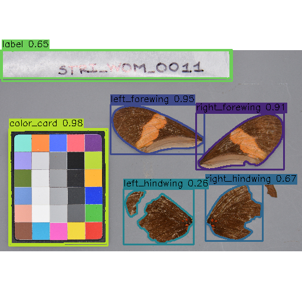

# Lepidoptera Wing Segmentation

This repository contains the scripts necessary to extract the following components using a YOLO v8 object detector and Meta's Segment Anything (SAM) model from butterfly images:
- wings (right forewing, right hindwing, left forewing, left hindwing) 
- ruler
- metadata label
- color palette


## Setting up your environment

1. Create conda environment
```
conda create -n yolo_segmentation python=3.10
```

2. Activate environment
```
conda activate yolo_segmentation
```

3. Install requirements
```
pip install -r requirements.txt
```

## 1. Preprocessing (OPTIONAL. Skip to Step 2 if you don't wish to resize your images)

The YOLO model does not require that you resize your images. However, if you wish to resize your images regardless, you can follow the steps below to do so. 

To resize your images, you can use either the `resize_images_flat_dir.py` or the `resize_images_subfolders.py` file in the `preprocessing_scripts` folder. The only difference between the two is the assumed folder structures. Both scripts will create a new directory containing your resized images such that the original images are not overwritten/modified. 

### Option 1: Resizing with `resize_images_flat_dir.py`
command: 
```
python3 resize_images_flat_dir.py --source /path/to/source/image/dataset/folder --output /path/to/new/folder/to/store/images --resize_dim 256 256
```

The script `resize_images_flat_dir.py` expects your source folder structure to look as such:
```
|-- Source_Image_Folder
|   |-- image_1.jpg
|   |-- image_2.jpg
|   |-- image_3.jpg
|   |-- image_4.jpg
|   |-- image_5.jpg
```

### Option 2: Resizing with `resize_images_subfolders.py`
command: 
```
python3 resize_images_subfolders.py --source /path/to/source/image/dataset/folder --output /path/to/new/folder/to/store/images --resize_dim 256 256
```

The script `resize_images_subfolders.py` expects your source folder structure to look as such:

```
|-- Source_Image_Folder
|   |--species_folder_1
|   |   |-- image_1.jpg
|   |   |-- image_2.jpg
|   |--species_folder_2
|   |   |-- image_1.jpg
|   |   |-- image_2.jpg
|   |--species_folder_3
|   |   |-- image_1.jpg
|   |   |-- image_2.jpg

```

## 2. Getting Segmentation Masks using YOLO Detection + SAM Model

To obtain masks for your set of images, run the `yolo_sam_predict_mask.py` script in the `segmentation_scripts` folder. The result will be a new folder containing all the segmentation masks for each of your images in the input directory.

Command: 

```
python3 wing-segmentation/segmentation_scripts/yolo_predict_masks.py --dataset /path/to/your/images --mask_csv /path/where/to/store/segmentation_info.csv
```

Arguments explained: 

`--dataset` is the full path to your folder containing your images you wish to obtain masks for. (Example: /User/micheller/data/jiggins_256_256)

`--mask_csv` is the path location at which you want to store the csv that gets created detailing which segmentation categories exist in the mask generated for each image. (Optional. Default segmentation.csv will be saved in the same directory from where you run this script.)

## 3. Removing background and background items from your wing images

The `segmentation_scripts` folder contains python scripts to help you remove the background of your images using the segmentation masks from our YOLO-SAM model. 

**Remove background only and replace with black background**

```
python3 wing-segmentation/segmentation_scripts/remove_background_black.py --image_dataset_path <path> --mask_dataset_path <path> --main_folder_name <folder_name>
```

**Remove background only and replace with white background**

```
python3 wing-segmentation/segmentation_scripts/remove_background_white.py --image_dataset_path <path> --mask_dataset_path <path> --main_folder_name <folder_name>
```

**Remove background and all items that are not wings. Wings are placed against a white background**

```
python3 wing-segmentation/segmentation_scripts/select_wings.py --images <path> --masks <path> --main_folder <folder_name>
```

## 4. Using Segmentation Masks to Extract Wings from Images

After obtaining masks for our images, we can crop out the forewings and hindwings by running the following `crop_wings_out.py` script in the `segmentation_scripts` folder:

Command:

```
python3 wing-segmentation/segmentation_scripts/crop_wings_out.py --images /path/to/butterfly/images --masks /path/to/segmentation/masks --output_folder /path/to/save/cropped/wings/to --pad <pixels to extend crop window by>
```

The `crop_wings_out.py` file will produce images like those below:







Arguments explained: 

`--images` is the path to the folder containing the set of images we got masks for in step 2.

`--masks` is the path to the folder created during step 2 containing the segmentation masks for the images.

`--output_folder` is the name of the folder you want to give to the folder that will contain the cropped wings.

`--pad` is the number of pixels to use as padding and extend the crop window by when cropping out wings. This argument is optional with a default value of 50. If the individual cropped wings are including neighboring wings too much for your liking, reduce this number to get a tighter window/crop around the wing. If the individual wing is getting cut off in the crop, increase this number. 

The cropped wing images will be named in this structure: `<original name>_wing_#.png`

The number following `wing` can be mapped as follows:

`1`: right forewing

`2`: left forewing

`3`: right hindwing

`4`: left hindwing

## 5. Creating seperate wing folders and flipping wings

The `landmark_scripts` folder contains python scripts to sort cropped wings into wing folders and flip images horizontally if needed.

Commands:

**Create wing folders**
```
python3 wing-segmentation/landmark_scripts/create_wing_folders.py --input_dir /path/to/folder/where/we/store/cropped/wing/results
```

**Flip images**
```console
python3 wing-segmentation/landmark_scripts/flip_images_horizontally.py --input_dir /path/to/wing/category/folder
```

# CLI Help

> [!CAUTION]
> The CLI is still under development. Please add an [issue](https://github.com/Imageomics/wing-segmentation/issues) for bug reports or feature requests.

The wing segmentation CLI tool is designed for convenient and flexible segmentation of butterfly images.

## Installation
In a virtual environment, you can install with:
```console
pip install git+https://github.com/Imageomics/wing-segmentation.git
```
If you would like a specific version of the package (e.g. `v0.1.0`), you can install with:
```console
pip install git+https://github.com/Imageomics/wing-segmentation.git@v0.1.0
```

## Usage

```console
usage: wingseg [-h] {segment,scan-runs} ...

Wing Segmenter CLI

options:
  -h, --help           show this help message and exit

Commands:
  {segment,scan-runs}
    segment            Segment images and store segmentation masks.
    scan-runs          List existing processing runs for a dataset. 
                       Requires outputs to have been generated with the --outputs-base-dir option.
```
### Options for `wingseg segment`

This command segments images and stores segmentation masks with a variety of options for resizing, padding, background removal, and more.

```console
usage: wingseg segment [-h] --dataset DATASET [--size SIZE [SIZE ...]] [--resize-mode {distort,pad}] [--padding-color {black,white}]
                       [--interpolation {nearest,linear,cubic,area,lanczos4,linear_exact,nearest_exact}] [--bbox-padding BBOX_PADDING]
                       [--outputs-base-dir OUTPUTS_BASE_DIR | --custom-output-dir CUSTOM_OUTPUT_DIR] [--sam-model SAM_MODEL] [--yolo-model YOLO_MODEL]
                       [--device {cpu,cuda}] [--visualize-segmentation] [--crop-by-class] [--force] [--remove-crops-background]
                       [--remove-full-background] [--background-color {white,black}]

Segment images and store segmentation masks.

options:
  -h, --help            show this help message and exit
  --dataset DATASET     Path to dataset images.
                        (default: None)
  --outputs-base-dir OUTPUTS_BASE_DIR
                        Base path to store outputs under an auto-generated directory, useful for testing and managing multiple runs.
                        Compatible with the scan-runs command.
                        (default: None)
  --custom-output-dir CUSTOM_OUTPUT_DIR
                        Fully custom directory to store all output files for a single run.
                        Not compatible with the scan-runs command.
                        (default: None)
  --sam-model SAM_MODEL
                        SAM model to use (e.g., facebook/sam-vit-base).
                        (default: facebook/sam-vit-base)
  --yolo-model YOLO_MODEL
                        YOLO model to use (local path or Hugging Face repo). 
                        (default: imageomics/butterfly_segmentation_yolo_v8:yolov8m_shear_10.0_scale_0.5_translate_0.1_fliplr_0.0_best.pt)
  --device {cpu,cuda}   Device to use for processing.
                        (default: cpu)
  --visualize-segmentation
                        Generate and save segmentation visualizations.
                        (default: False)
  --crop-by-class       Enable cropping of segmented classes into crops/ directory.
                        (default: False)
  --force               Force reprocessing even if outputs already exist.
                        (default: False)

Resizing Options:
  --size SIZE [SIZE ...]
                        Target size. Provide one value for square dimensions or two for width and height. 
                        (default: None)
  --resize-mode {distort,pad}
                        Resizing mode. "distort" resizes without preserving aspect ratio, "pad" preserves aspect ratio and adds padding if necessary. 
                        Required with --size. 
                        (default: None)
  --padding-color {black,white}
                        Padding color to use when --resize-mode is "pad".
                        (default: None)
  --interpolation {nearest,linear,cubic,area,lanczos4,linear_exact,nearest_exact}
                        Interpolation method to use when resizing. For upscaling, "lanczos4" is recommended.
                        (default: area)

Bounding Box Options:
  --bbox-padding BBOX_PADDING
                        Padding to add to bounding boxes in pixels.
                        (default: None)

Background Removal Options:
  --remove-crops-background
                        Remove background from cropped images.
                        (default: False)
  --remove-full-background
                        Remove background from the entire (resized or original) image.
                        (default: False)
  --background-color {white,black}
                        Background color to use when removing background.
                        (default: None)
```

### Options for `wingseg scan-runs`

This command provides a tabular overview of segmentation runs for comparing effects of segmentation option settings:

```console
usage: wingseg scan-runs [-h] --dataset DATASET [--outputs-base-dir OUTPUTS_BASE_DIR]

List existing processing runs for a dataset. 
Requires outputs to have been generated with the --outputs-base-dir option.

options:
  -h, --help            show this help message and exit
  --dataset DATASET     Path to the dataset directory
                        (default: None)
  --outputs-base-dir OUTPUTS_BASE_DIR
                        Base path where outputs were stored.
                        (default: None)
```

### Example Usage

For instance, if you have a dataset of images in `../data/input/`, and you would like segmented outputs stored under `../data/output/` you can segment these images with the following command:
```console
wingseg segment --dataset ../data/input/ \
  --outputs-base-dir ../data/output/ \
  --visualize-segmentation \
  --crop-by-class \
  --size 512 \
  --resize-mode pad \
  --padding-color white \
  --interpolation cubic \
  --remove-crops-background \
  --remove-full-background \
  --background-color white
```
Depending on the contents of `../data/input/`, the command above will produce the following status indicator:
```console
INFO:root:Loading YOLO model: imageomics/butterfly_segmentation_yolo_v8:yolov8m_shear_10.0_scale_0.5_translate_0.1_fliplr_0.0_best.pt
INFO:root:YOLO model loaded onto cpu
INFO:root:Loading SAM model: facebook/sam-vit-base
INFO:root:Loaded SAM model and processor successfully.
INFO:root:Processing 18 images
INFO:root:Output directory: /abs/path/to/data/output/input_3354acb9-b295-5d07-9397-8ec5c74cee37
Processing Images:   6%|█████▌                                                                                               | 1/18 [00:14<04:09, 14.67s/image]
```
Note that the unique identifier appended to the output directory is a UUID that depends on certain options specified in the command as well as the input dataset. This is to ensure that the output directory is unique and does not overwrite existing results.

For example, it may be useful to compare the effects of resize dimensions with squares of size [256, 512, 1024].

Once these are processed, you can use the `scan-runs` command for a tabular overview of the segmentation runs:
```console
wingseg scan-runs --dataset ../data/input/ \
  --outputs-base-dir ../data/output/
Found 3 processing runs for dataset 'input':

                                             Processing Runs                                             
┏━━━━━━━┳━━━━━━━━━━┳━━━━━━━━━━━┳━━━━━━━━━━━━┳━━━━━━━━━━━━━┳━━━━━━━━━┳━━━━━━━━━━━━━━━┳━━━━━━━━━━┳━━━━━━━━┓
┃       ┃ Run UUID ┃           ┃            ┃             ┃ Resize  ┃               ┃          ┃        ┃
┃ Run # ┃ Prefix   ┃ Completed ┃ Num Images ┃ Resize Dims ┃  Mode   ┃    Interp     ┃ BBox Pad ┃ Errors ┃
┡━━━━━━━╇━━━━━━━━━━╇━━━━━━━━━━━╇━━━━━━━━━━━━╇━━━━━━━━━━━━━╇━━━━━━━━━╇━━━━━━━━━━━━━━━╇━━━━━━━━━━╇━━━━━━━━┩
│     1 │ 3354acb9 │    Yes    │         18 │   512x512   │   pad   │     cubic     │        0 │  None  │
├───────┼──────────┼───────────┼────────────┼─────────────┼─────────┼───────────────┼──────────┼────────┤
│     2 │ 0f27d745 │    Yes    │         18 │   256x256   │   pad   │     cubic     │        0 │  None  │
├───────┼──────────┼───────────┼────────────┼─────────────┼─────────┼───────────────┼──────────┼────────┤
│     3 │ 8e9ae0a2 │    Yes    │         18 │  1024x1024  │   pad   │     cubic     │        0 │  None  │
└───────┴──────────┴───────────┴────────────┴─────────────┴─────────┴───────────────┴──────────┴────────┘
```

This can be helpful navigating the outputs of multiple segmentation runs:
```console
$ ls -1 ../data/output/*
../data/output/input_0f27d745-12ce-50b9-a28c-5641dbfaea49:
crops
crops_bkgd_removed
full_bkgd_removed
logs
masks
metadata
resized
seg_viz

../data/output/input_3354acb9-b295-5d07-9397-8ec5c74cee37:
<similarly>

../data/output/input_8e9ae0a2-992c-579d-bb51-b8715442bcf4:
<similarly>
```

Inspecting data in the `seg_viz/`, we can see that the 1024x1024 products have segmentation masks that differ from the 512x512 and 256x256 products.

1024x1024 (Run 8e9ae0a2):



512x512 (Run 3354acb9):



256x256 (Run 0f27d745):


A potential fix for this could be to add padding to the bounding boxes (with the `--bbox-padding` option) wherever results are inconsistent with expectations.

Once you are satisfied with the outputs, you can use the `wingseg segment` command with the `--custom-output-dir` option specified to store all output files for a single run in a custom directory.

## Further Development

For developers contributing to the CLI, clone the repository, set up and activate a virtual environment, then install in editable mode with development dependencies:
```console
pip install -e .[dev]
```

# Acknowledgements
Example images used in this README are from:
- Christopher Lawrence, Owen McMillan, Daniel Romero, Carlos Arias. (2024). Smithsonian Tropical Research Institute (STRI) Samples. Hugging Face. https://huggingface.co/datasets/imageomics/STRI-Samples.
